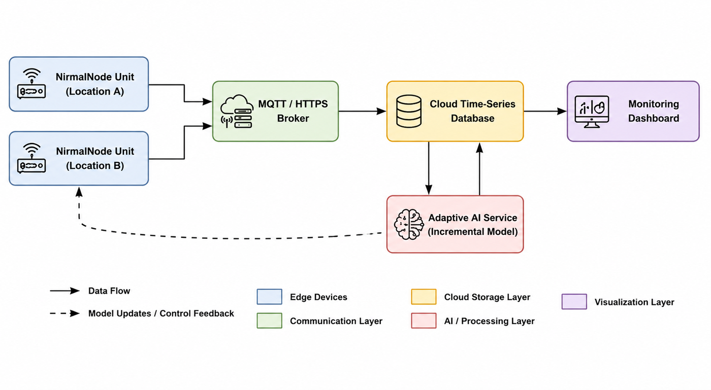
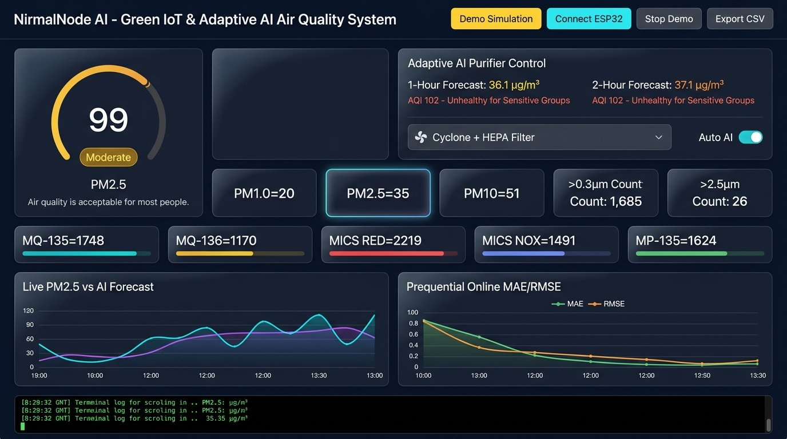
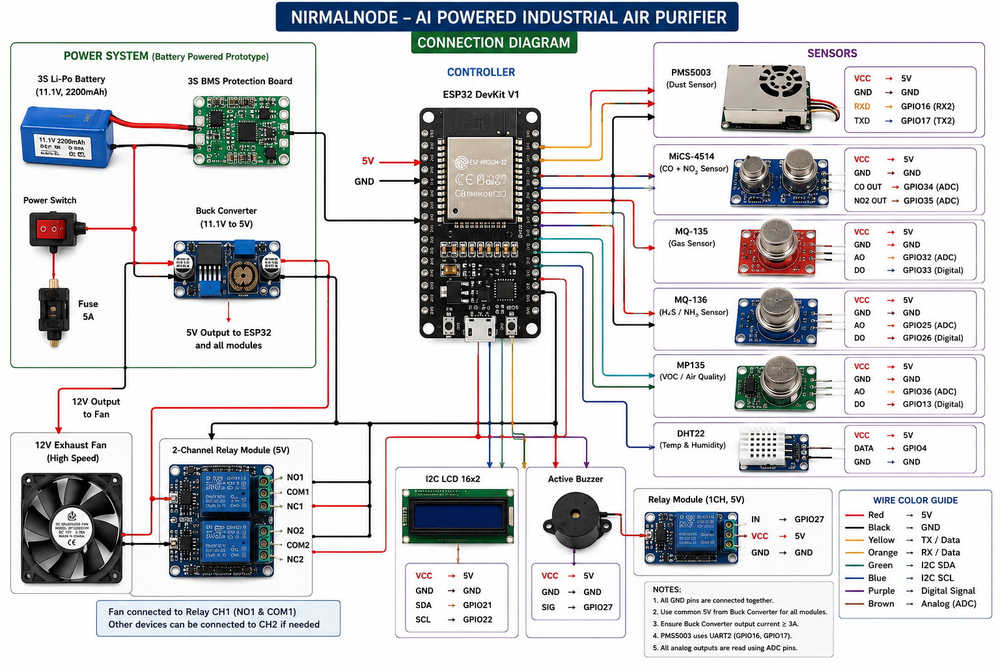
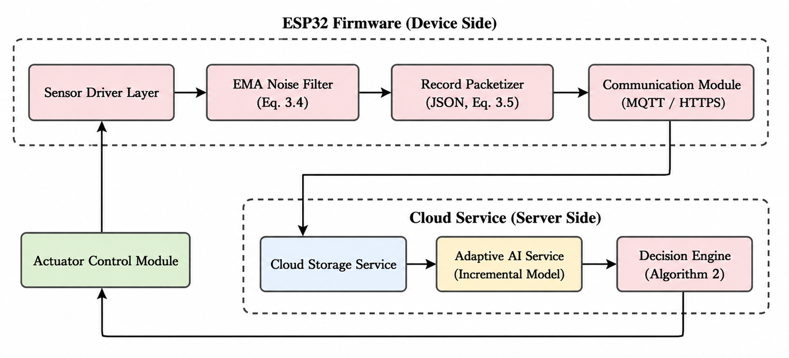
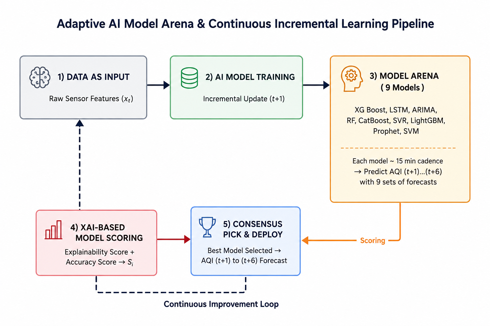
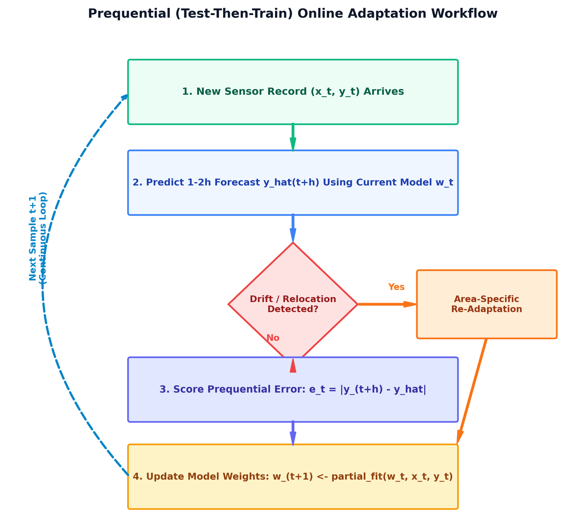
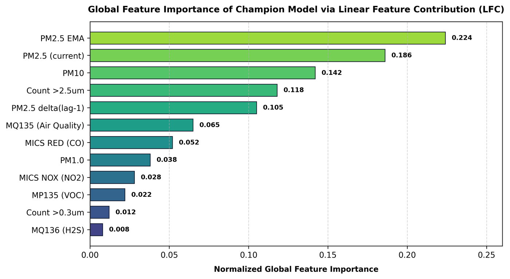
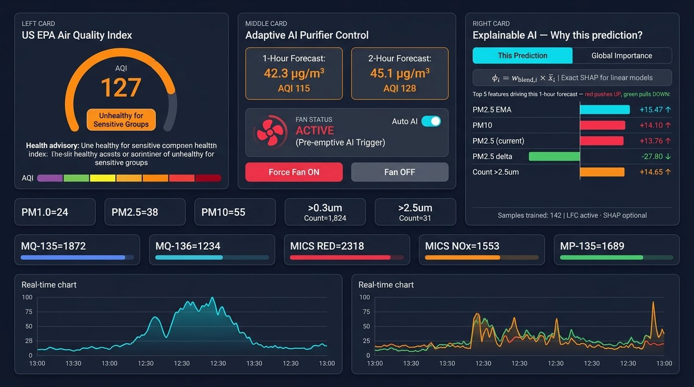
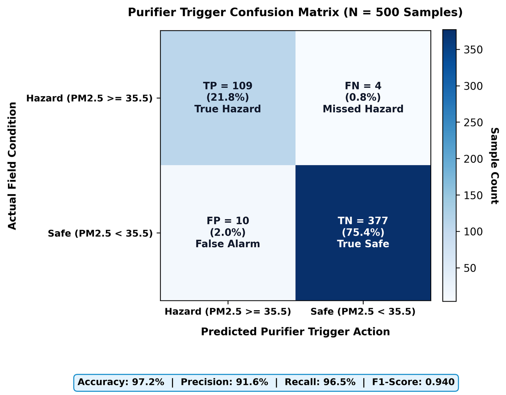
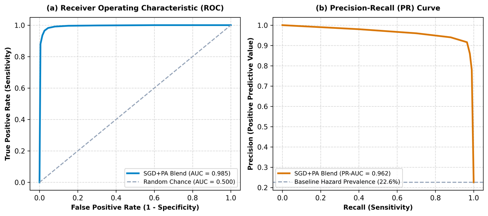

<div align="center">

# 🌿 NirmalNode
### IoT-Based Air Quality Monitoring & Adaptive AI Purification System

[](https://youtu.be/-UmP3GxATWU)

**▶️ [Watch Full Demo on YouTube](https://youtu.be/-UmP3GxATWU)**


</div>

---

## 📌 Overview

**NirmalNode** is a real-time, low-cost IoT air quality monitoring system that uses an **ESP32 microcontroller** with multiple gas and particulate sensors to measure indoor/outdoor air pollution. An **adaptive online machine learning model** (Scikit-learn) runs on a local Python backend to predict PM2.5 spikes up to **2 hours in advance** and automatically trigger an air purifier.

> Built as a final-year Capstone project at **UFT** — combining Green IoT, Edge Computing, and Explainable AI (XAI).

---

## 🖼️ Screenshots & Diagrams

### 🏗️ System Architecture


### 📊 Live Dashboard


### 🔧 Hardware Block Diagram


### 💻 Software Architecture


### 🤖 AI Model Pipeline


### 📈 Incremental Learning Pipeline


### 🧠 XAI Feature Importance


### 📉 XAI Dashboard Panel


### 📊 Model Performance (Confusion Matrix)


### 📉 ROC & PR Curves


### 🔥 Real-World Hotspot Detection
| Smoke | Welding Fumes |
|---|---|
|  |  |

---

## ✨ Features

| Feature | Description |
|---|---|
| 🌫️ **Live PM2.5 / PM10 / PM1.0** | Real-time particulate sensing via PMS5003 |
| 🧪 **Multi-gas Detection** | MQ135, MQ136, MiCS-4514 (CO, NO₂, NH₃) |
| 🤖 **Adaptive Online ML** | `SGDRegressor` + `PassiveAggressiveRegressor` with `partial_fit()` |
| 📈 **1H & 2H AQI Forecast** | Predicts future air quality before it gets hazardous |
| 🔔 **Auto Purifier Trigger** | Relay-controlled fan activates before pollution spikes |
| 📊 **Live Web Dashboard** | Real-time charts, EPA AQI gauge, XAI explanations |
| 🧠 **Explainable AI (XAI)** | SHAP-based feature importance shown in dashboard |
| 📡 **WiFi + USB Modes** | Works over WiFi or direct USB Serial connection |
| 💾 **CSV Data Export** | One-click export of all sensor readings for research |

---

## 🏗️ System Architecture

```
┌─────────────────────┐        ┌──────────────────────┐        ┌─────────────────┐
│   ESP32 Hardware    │──USB/──▶│   Python Backend     │──────▶│  Web Dashboard  │
│                     │  WiFi  │   (server.py)         │  HTTP │  (index.html)   │
│  • PMS5003 (PM)     │        │                       │       │                 │
│  • MQ135 (CO₂/VOC) │        │  • Online ML Engine   │       │  • AQI Gauge    │
│  • MQ136 (H₂S)     │        │  • AQI Calculator     │       │  • Live Charts  │
│  • MiCS-4514        │        │  • Purifier Control   │       │  • XAI Panel    │
│  • Relay (Fan)      │        │  • WebSerial API      │       │  • CSV Export   │
└─────────────────────┘        └──────────────────────┘        └─────────────────┘
```

---

## 📂 Project Structure

```
NirmalNode/
│
├── 📁 NirmalNode_LiveAPI/          # ESP32 Arduino Firmware (WiFi + Serial)
│   └── NirmalNode_LiveAPI.ino
│
├── 📁 AirGuard/                    # ESP32 Firmware (USB Direct Mode)
│   └── AirGuard.ino
│
├── 📁 AirGuard_Calibrated/         # Calibrated sensor firmware
├── 📁 AirGuard_WiFi/               # WiFi-only firmware variant
│
├── 📁 backend/                     # Python Flask backend
│   └── server.py
│
├── 📁 dashboard/                   # Standalone web dashboard
│   ├── index.html
│   └── app.js
│
├── 📁 models/                      # Trained ML model files (.pkl)
├── 📁 data/                        # Dataset (Bangladesh AQI hourly data)
├── 📁 features/                    # Feature engineering scripts
├── 📁 training/                    # ML training scripts
├── 📁 evaluation/                  # Model evaluation & metrics
├── 📁 experiments/                 # Experiment logs & results
├── 📁 docs/images/                 # All diagrams & screenshots
│
├── 🌐 index.html                   # Main live dashboard (open in browser)
├── 🎨 style.css                    # Dashboard styling
├── ⚙️ app.js                       # Dashboard logic & WebSerial API
├── 🐍 server.py                    # Python backend server
├── 🤖 nirmal_ml_engine.py          # Core adaptive ML engine
└── 📋 README.md
```

---

## 🔧 Hardware Required

| Component | Purpose |
|---|---|
| **ESP32 / ESP32-S3** | Main microcontroller |
| **PMS5003** | PM1.0 / PM2.5 / PM10 particulate sensor |
| **MQ135** | CO₂, VOC, NH₃ gas sensor |
| **MQ136** | H₂S (hydrogen sulfide) sensor |
| **MiCS-4514** | CO and NO₂ dual-channel sensor |
| **5V Relay Module** | Controls air purifier / fan |
| **DHT22** *(optional)* | Temperature & humidity |

---

## 🚀 Quick Start

### Option 1: Browser Only (No Python Needed)
1. Plug **ESP32** into PC via USB
2. Open `index.html` in **Chrome** or **Edge**
3. Click **"Connect ESP32 Hardware"**
4. Select the COM port → Live data starts!

### Option 2: Full Backend (With ML Predictions)
```bash
# 1. Install dependencies
pip install flask scikit-learn numpy pandas pyserial

# 2. Run the server
python server.py

# 3. Open browser
# → http://localhost:5000
```

### Option 3: Quick Start Script (Windows)
```bat
START_NirmalNode.bat
```

---

## 🤖 ML Model Details

The adaptive learning pipeline uses **online incremental learning** — no retraining needed:

```python
# Core model: continuously learns from live sensor data
from sklearn.linear_model import SGDRegressor, PassiveAggressiveRegressor

model.partial_fit(X_live, y_live)  # Updates in real-time, every reading!
```

- **Input features:** PM2.5, PM10, MQ135, MQ136, MiCS RED/NOX, temperature, humidity, time
- **Output:** Predicted PM2.5 concentration at t+1h and t+2h
- **Error metric:** Prequential MAE (shown live in dashboard)
- **XAI:** SHAP feature importance updated every 10 readings

---

## 📄 Research & Documentation

- 📹 **Demo Video:** [youtu.be/-UmP3GxATWU](https://youtu.be/-UmP3GxATWU)
- 📊 **Dataset:** Bangladesh AQI Hourly Data 2000–2025 (Mendeley)

---

## 👨‍💻 Author

**Rakib**  
🎓 Department of Internet of Things and Robotics Engineering (IRE)  
🏛️ University of Frontier Technology, Bangladesh (UFTB)  
📌 Capstone Project  
🐙 GitHub: [@rakibdipu](https://github.com/rakibdipu)

---

<div align="center">
⭐ If this project helped you, give it a star!
</div>
